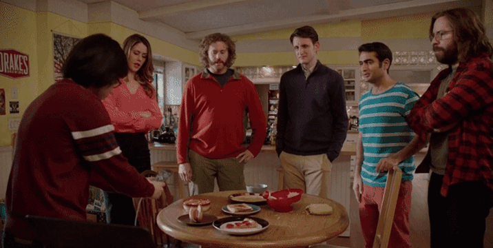

# SeeFood
SeeFood is a Swift app that uses a convolutional neural network to identify hotdogs.

SeeFood uses Apple's new machine learning library [CoreML](https://developer.apple.com/machine-learning/core-ml/.)
## History
SeeFood was an app I decided to build after watching [Jian Yang's app](https://www.youtube.com/watch?v=vIci3C4JkL0) from the HBO Silicon Valley show.

## Contributing
Pull requests are welcome. For major changes, please open an issue first to discuss what you would like to change.

Please make sure to update tests as appropiate as possible.

## License
[MIT](https://choosealicense.com/licenses/mit/)